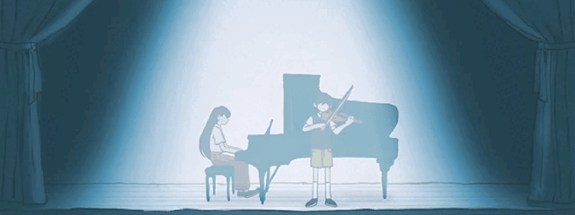

<!-- ===== 1. BANNER ===== -->

  

<!-- ===== 2. NAMA ===== -->

<h1 align="center">Hi, I'm Adiss 👋</h1>

<!-- ===== 3. PERAN (animasi ngetik) ===== -->

  

  

## 👨‍💻 Tentang Saya

- 🚀 Membangun aplikasi web dari sisi **frontend sampai backend**
- 🎯 Fokus pada kode yang rapi, terstruktur, dan mudah dikembangkan
- 🌱 Terus belajar teknologi baru lewat proyek nyata
- 💬 Tanya saya tentang: **HTML, CSS, Dart/Flutter, Python**

## 🛠️ Tech Stack

  
  
  
  
  
  
  
  

## 📌 Proyek Unggulan

| Proyek | Deskripsi | Teknologi |
|--------|-----------|-----------|
| [BlogApp-Bloggerist](https://github.com/Fictophilians/BlogApp-Bloggerist) | Aplikasi blog |  |
| [Portofolio-Website](https://github.com/Fictophilians/Portofolio-Website) | Website portofolio pribadi |  |
| [JobLine](https://github.com/Fictophilians/JobLine) | Platform lowongan kerja |  |
| [Projek_KKA-dataNilai_siswa](https://github.com/Fictophilians/Projek_KKA-dataNilai_siswa) | Pengolahan data nilai siswa |  |

## 📊 GitHub Stats

  
  

  

## 🤝 Mari Terhubung

  
  
  

<!-- ===== FOOTER ===== -->

  

